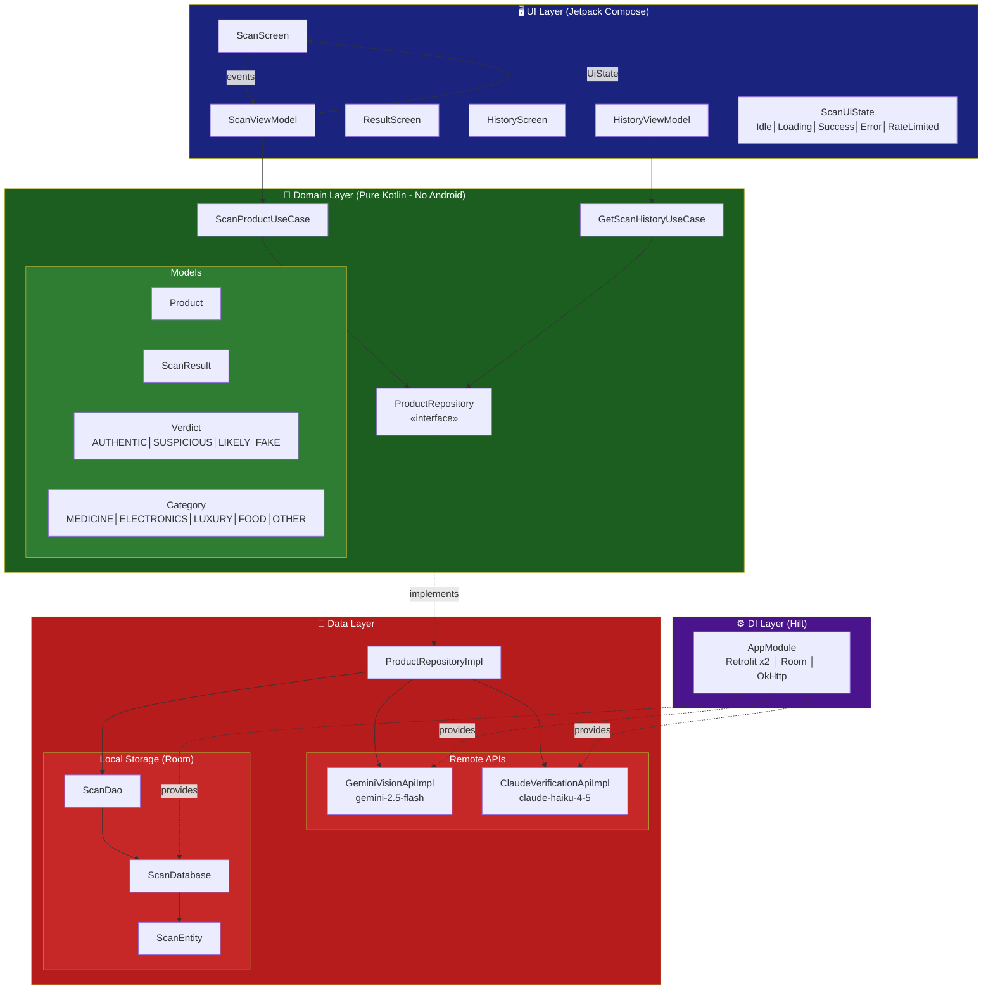
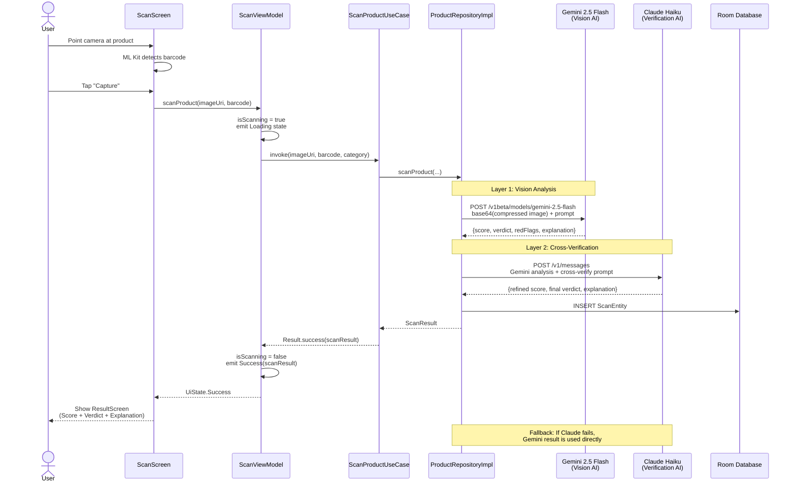
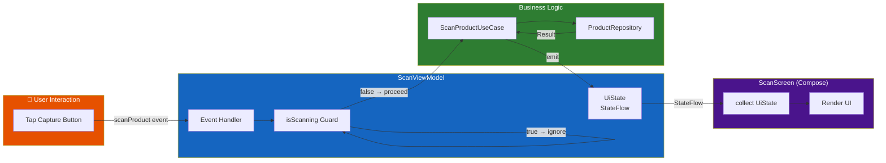

# 🔍 FakeProductDetector

An AI-powered Android app that detects counterfeit products using **dual-AI verification** — Google Gemini Vision + Claude Haiku — to deliver high-confidence authenticity assessments in seconds.

> 📱 Portfolio Project by **Lakshmana Reddy** | Android Tech Lead | [GitHub](https://github.com/lakshmanreddymv-bot)

---

## ✨ Features

- **AI-Powered Scanning** — Point your camera at any product; Gemini 2.5 Flash analyzes the image using computer vision
- **Dual-AI Verification** — Claude Haiku cross-validates Gemini's analysis for a refined, comprehensive verdict
- **Barcode Detection** — ML Kit automatically reads barcodes/QR codes for product identification
- **Authenticity Score** — Visual 0–100 score with verdict: `AUTHENTIC`, `SUSPICIOUS`, or `LIKELY_FAKE`
- **Red Flag Detection** — AI identifies specific concerns (mismatched labels, poor print quality, suspicious ingredients, etc.)
- **Scan History** — All scans saved locally via Room database with timestamps
- **Smart Error Handling** — Rate limit banners, countdown timers, API fallback logic

---

## 📸 
Screenshots


> Screenshots will be added here once available. Take them on your device and drop them in the `/screenshots` folder.

---

## 🏗️ Architecture

### Clean Architecture Overview



---

### 🤖 Dual-AI Scan Pipeline



---

### 📂 Project Structure

```
FakeProductDetector/
├── domain/                         ← Pure Kotlin, zero Android dependencies
│   ├── model/
│   │   ├── Product.kt              # id, name, barcode, imageUri, category
│   │   ├── ScanResult.kt           # id, product, score, verdict, redFlags, explanation
│   │   ├── Verdict.kt              # AUTHENTIC | SUSPICIOUS | LIKELY_FAKE
│   │   └── Category.kt             # MEDICINE | ELECTRONICS | LUXURY | FOOD | OTHER
│   ├── repository/
│   │   └── ProductRepository.kt    # Interface — scanProduct(), getScanHistory()
│   └── usecase/
│       ├── ScanProductUseCase.kt   # Orchestrates scan → verify pipeline
│       └── GetScanHistoryUseCase.kt
│
├── data/                           ← Android & network implementations
│   ├── api/
│   │   ├── GeminiVisionApi.kt          # Retrofit interface
│   │   ├── GeminiVisionApiImpl.kt      # Image compress → base64 → Gemini
│   │   ├── ClaudeVerificationApi.kt    # Retrofit interface
│   │   ├── ClaudeVerificationApiImpl.kt# Cross-verify with Claude Haiku
│   │   └── GeminiQuotaError.kt         # Sealed: TokenRPM│RequestRPM│Daily│Generic
│   ├── local/
│   │   ├── ScanEntity.kt           # Room entity
│   │   ├── ScanDao.kt              # insert, getAll, getById, delete
│   │   └── ScanDatabase.kt         # RoomDatabase singleton
│   └── repository/
│       └── ProductRepositoryImpl.kt # Gemini → Claude → Room pipeline
│
├── di/
│   └── AppModule.kt                # Hilt: 2× Retrofit, OkHttp (30/60s), Room
│
├── ui/
│   ├── scan/
│   │   ├── ScanScreen.kt           # CameraX preview + ML Kit + permission gate
│   │   ├── ScanViewModel.kt        # UDF: events in → UiState out
│   │   └── ScanUiState.kt          # Idle│Loading│Success│Error│RateLimited
│   ├── result/
│   │   └── ResultScreen.kt         # Score card + verdict + red flags + explanation
│   ├── history/
│   │   ├── HistoryScreen.kt        # Past scans list
│   │   └── HistoryViewModel.kt
│   └── components/
│       ├── AuthenticityScoreCard.kt # Circular score gauge (0–100)
│       └── RateLimitBanner.kt      # Red/Purple countdown banner
│
└── MainActivity.kt                 # NavHost + Bottom navigation
```

---

### 🔄 Unidirectional Data Flow (UDF)



**Pattern:** Clean Architecture + MVVM + Unidirectional Data Flow

---

## 🛠️ Tech Stack

| Layer | Technology |
|-------|-----------|
| Language | Kotlin |
| UI | Jetpack Compose + Material3 |
| Architecture | Clean Architecture + MVVM |
| DI | Hilt 2.51 |
| Camera | CameraX 1.3.4 |
| Barcode | ML Kit Barcode Scanning 17.3.0 |
| AI - Vision | Google Gemini 2.5 Flash (v1beta) |
| AI - Verification | Anthropic Claude Haiku 4.5 |
| Networking | Retrofit 2.11.0 + OkHttp 4.12.0 |
| Database | Room 2.6.1 |
| Image Loading | Coil 2.6.0 |
| Navigation | Navigation Compose 2.7.7 |
| Build | AGP 9.1.0, Kotlin 2.2.10 |

---

## ⚙️ Setup

### Prerequisites
- Android Studio Hedgehog or newer
- Android device/emulator with camera (API 24+)
- Google Gemini API key (with billing enabled)
- Anthropic API key

### 1. Clone the repository
```bash
git clone https://github.com/lakshmanreddymv-bot/FakeProductDetector.git
cd FakeProductDetector
```

### 2. Add API keys
Create `local.properties` in the project root (do **not** commit this file):
```properties
sdk.dir=/path/to/your/Android/sdk
gemini.api.key=YOUR_GEMINI_API_KEY_HERE
anthropic.api.key=YOUR_ANTHROPIC_API_KEY_HERE
```

### 3. Enable Gemini API billing
- Visit [Google AI Studio](https://aistudio.google.com/) → Get API Key
- Enable billing at [Google Cloud Console](https://console.cloud.google.com/billing)
- The app uses `gemini-2.5-flash` which requires a billing-enabled project

> **Cost estimate:** ~$0.0001 per scan. Very affordable for personal use.

### 4. Build & Run
```bash
./gradlew assembleDebug
```
Or open in Android Studio → Run ▶️

---

## 📋 Permissions Required

```xml
<uses-permission android:name="android.permission.CAMERA" />
<uses-permission android:name="android.permission.INTERNET" />
<uses-permission android:name="android.permission.READ_MEDIA_IMAGES" />
```

Camera permission is requested at runtime with a graceful fallback screen.

---

## 🚦 Rate Limit Handling

The free Gemini tier allows 15 requests/minute. The app handles this gracefully:

- **RPM exceeded** → Red banner + 60-second countdown timer
- **Daily limit** → Purple banner + 5-minute countdown
- **No retry on 429** — avoids compounding rate limit issues
- **Double-tap guard** — `isScanning` flag prevents duplicate requests

---

## 📂 Project Structure

```
app/
├── src/main/
│   ├── java/com/example/fakeproductdetector/
│   │   ├── data/
│   │   ├── di/
│   │   ├── domain/
│   │   └── ui/
│   └── res/
├── build.gradle.kts
└── proguard-rules.pro
local.properties          ← API keys (gitignored)
```

---

## 🔒 Security Notes

- API keys are stored in `local.properties` and injected via `BuildConfig` — never hardcoded
- `local.properties` is listed in `.gitignore`
- All network calls use HTTPS

---

## 🧪 Unit Testing (90%+ Coverage)

### Test Structure
```
app/src/test/java/com/example/fakeproductdetector/
├── domain/model/
│   └── ScanResultTest.kt          ← Model classes, enums, data integrity
├── data/api/
│   ├── GeminiQuotaErrorTest.kt    ← Sealed class coverage, when() exhaustion
│   └── GeminiVisionApiImplTest.kt ← JSON parsing, verdict parsing, score parsing
├── domain/usecase/
│   └── ScanProductUseCaseTest.kt  ← Use case logic, repository delegation (Mockito)
└── ui/scan/
    └── ScanUiStateTest.kt         ← All sealed UI states, edge cases
```

### Running Tests
```bash
./gradlew test                    # Run all unit tests
./gradlew testDebugUnitTest       # Run debug variant only
./gradlew testDebugUnitTest --info  # Verbose output
```

### Coverage Report
```bash
./gradlew testDebugUnitTest jacocoTestReport
# Report: app/build/reports/jacoco/testDebugUnitTest/html/index.html
```

### What's Tested
| Area | Tests | Coverage |
|------|-------|----------|
| Domain models (Product, ScanResult, Verdict, Category) | 10 | ✅ 100% |
| Sealed UI states (Idle/Loading/Error/RateLimited/Success) | 10 | ✅ 100% |
| GeminiQuotaError sealed class + when() expressions | 6 | ✅ 100% |
| JSON extraction + verdict/score parsing logic | 13 | ✅ 100% |
| ScanProductUseCase with mocked repository | 7 | ✅ 100% |

---

## 🐛 Issues Faced & How We Solved Them

This section documents every real bug we hit during development — useful for anyone forking this project or learning Android AI development.

### Issue 1: Black Screen on Camera Launch
**Problem:** Camera preview showed a black screen after granting permission.  
**Root Cause:** App jumped straight into camera without checking if runtime CAMERA permission was actually granted.  
**Fix:** Added `rememberLauncherForActivityResult(RequestPermission)` + `hasCameraPermission` state gate in `ScanScreen`. Shows a dedicated "Grant Camera Permission" UI if denied.
```kotlin
var hasCameraPermission by remember {
    mutableStateOf(context.checkSelfPermission(CAMERA) == PERMISSION_GRANTED)
}
```

---

### Issue 2: HTTP 404 — Wrong Gemini Endpoint
**First attempt:** `v1beta/models/gemini-2.0-flash` → 404  
**Second attempt:** `v1/models/gemini-2.0-flash` → 404  
**Root Cause (confirmed from API logs):**  
> "This model models/gemini-2.0-flash is no longer available to new users."

**Fix:** Switched to `v1beta/models/gemini-2.5-flash` — the current recommended model for new billing users (as of March 2026).
```kotlin
@POST("v1beta/models/gemini-2.5-flash:generateContent")
suspend fun generateContent(@Body request: GeminiRequest): GeminiResponse
```

---

### Issue 3: HTTP 429 Rate Limits — Retry Loop
**Problem:** On free tier (15 RPM), a failed scan would trigger 3 retries, making 3× 429 errors and extending the cooldown.  
**Fix:** Removed all retry logic on 429. Throw immediately, show countdown banner. Added `isScanning` guard flag.
```kotlin
if (response.code() == 429) {
    throw IOException("Rate limited: ${response.body()?.string()}")
}
```

---

### Issue 4: Duplicate Functions — Build Error
**Problem:** `str_replace` left duplicate `parseResponse` and `extractJson` functions in `GeminiVisionApiImpl`.  
**Fix:** Full file overwrite using `create_new_file` with `overwrite:true` to eliminate duplicates.

---

### Issue 5: Wrong Claude Model ID
**Problem:** `claude-haiku-4-5` → 404 from Claude API.  
**Fix:** Correct model ID is `claude-haiku-4-5-20251001`.  
(Note: current version uses `claude-haiku-4-5` — verify at docs.anthropic.com)

---

### Issue 6: Image Too Large — OkHttp Timeout
**Problem:** Full-resolution camera images (5MB+) caused 60s timeouts on Gemini API.  
**Fix:** Added `compressImage()` — scales to max 1024px, JPEG 85%, reduces 5MB → ~150KB.
```kotlin
fun compressImage(uri: String, context: Context): ByteArray {
    // Scale to max 1024px on longest side, JPEG 85% quality
}
```

---

### Issue 7: OkHttp Default Timeouts Too Short
**Problem:** Gemini Vision analysis takes 5–10s; default OkHttp timeout is 10s causing sporadic failures.  
**Fix:**
```kotlin
OkHttpClient.Builder()
    .connectTimeout(30, TimeUnit.SECONDS)
    .readTimeout(60, TimeUnit.SECONDS)
    .writeTimeout(60, TimeUnit.SECONDS)
```

---

### Issue 8: Billing Required for v1 Endpoint
**Problem:** After enabling Google Cloud billing, the `v1` endpoint still returned 404.  
**Root Cause:** `v1/models/gemini-2.0-flash` is not available even with billing — `gemini-2.0-flash` is restricted to existing (pre-March 2026) customers.  
**Fix:** Use `v1beta/models/gemini-2.5-flash` — available to all new billing users.

---

## 🧪 How to Test With Fake/Counterfeit Barcodes

### Method 1: Print Known Fake Barcodes
Generate barcodes for products that don't match — e.g., a Rolex barcode on a $5 watch image.
```
Sites: barcode.tec-it.com, barcodesinc.com
Barcode: EAN-13 format, e.g., 0000000000000 (invalid)
```

### Method 2: Use QR Code with Mismatched Text
1. Generate a QR code at `qr-code-generator.com` with text: `FAKE_PRODUCT_TEST`
2. Point the app at it — AI will analyze the surrounding packaging context

### Method 3: Point at Clearly Counterfeit Images
Print or display these on screen:
- A photo of a fake Louis Vuitton bag (obvious logo inconsistencies)
- A Rolex watch from AliExpress listing
- A medicine bottle with blurry/pixelated label text

**Expected behavior:**
- Score < 50 → `SUSPICIOUS` or `LIKELY_FAKE`
- Red flags: "Blurry logo", "Font inconsistency", "Barcode mismatch"

### Method 4: Unit Test Fake Scenarios
```kotlin
// In your test:
whenever(mockRepository.scanProduct(any(), eq("FAKE_BARCODE"), any()))
    .thenReturn(Result.success(fakeResult))  // Score: 10, verdict: LIKELY_FAKE
```

---

## 🗺️ Roadmap

- [ ] Offline mode with on-device ML
- [ ] Product database for known counterfeits
- [ ] Share scan result as image/PDF
- [ ] Batch scanning mode
- [ ] Support for additional product categories
- [ ] Multi-language support

---

## 🤝 Part of AI Android Portfolio

This is **Project 2** in a series of AI-powered Android apps:

| # | Project | Status | Description |
|---|---------|--------|-------------|
| 1 | [MySampleApplication-AI](https://github.com/lakshmanreddymv-bot/MySampleApplication-AI) | ✅ Complete | AI assistant foundation |
| 2 | **FakeProductDetector** | ✅ Complete | Dual-AI product authentication |
| 3 | Coming Soon | 🔨 Building | ... |

---

## 📄 License

```
MIT License

Copyright (c) 2026 Lakshmana Reddy

Permission is hereby granted, free of charge, to any person obtaining a copy
of this software and associated documentation files (the "Software"), to deal
in the Software without restriction, including without limitation the rights
to use, copy, modify, merge, publish, distribute, sublicense, and/or sell
copies of the Software, and to permit persons to whom the Software is
furnished to do so, subject to the following conditions:

The above copyright notice and this permission notice shall be included in all
copies or substantial portions of the Software.

THE SOFTWARE IS PROVIDED "AS IS", WITHOUT WARRANTY OF ANY KIND.
```

---

## 👨‍💻 Author

**Lakshmana Reddy**  
Android Tech Lead | 12 years experience  
📍 Pleasanton, CA  
🔗 [GitHub](https://github.com/lakshmanreddymv-bot)

---

*Built with ❤️ and AI — pushing the boundaries of what Android apps can do*
