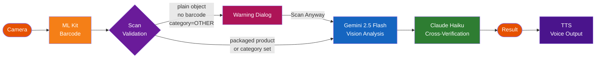
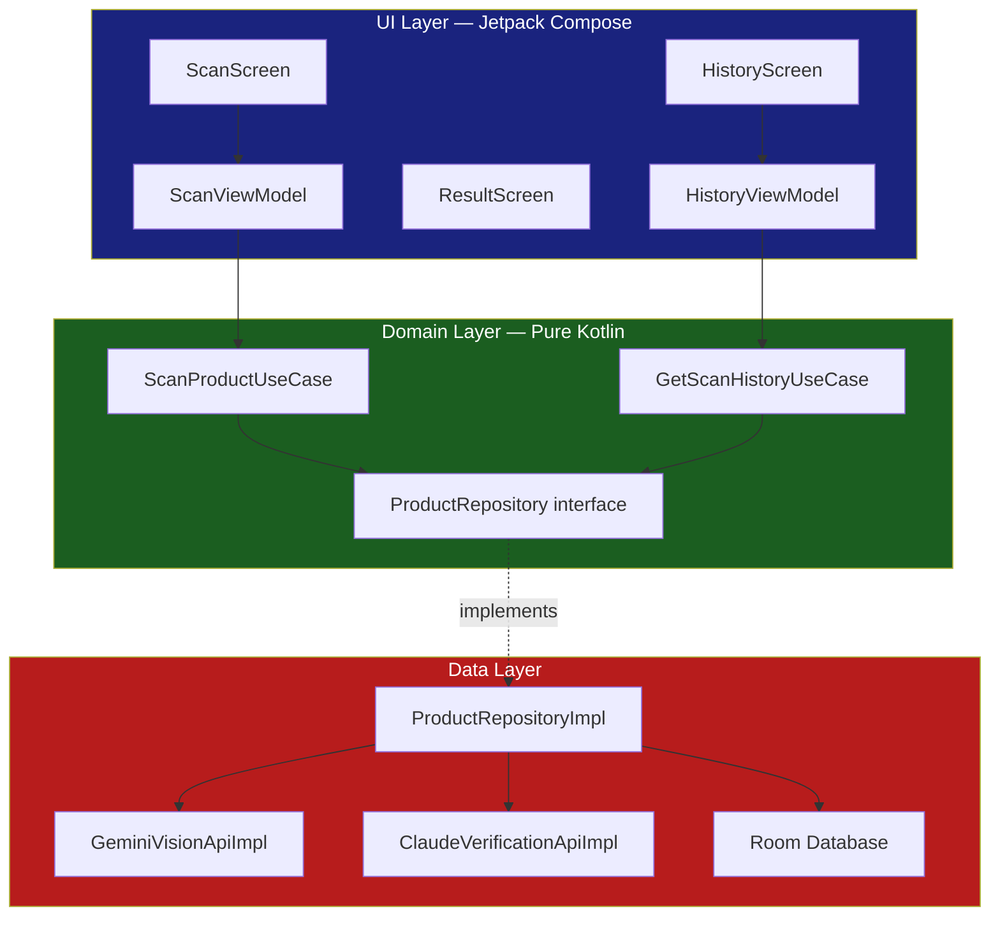
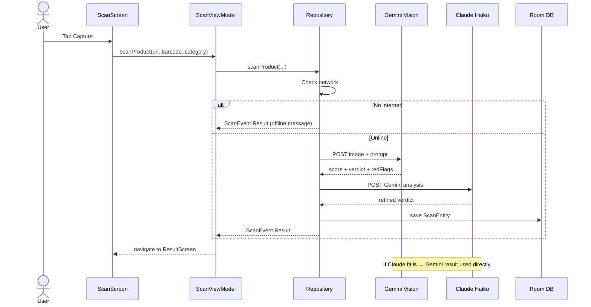
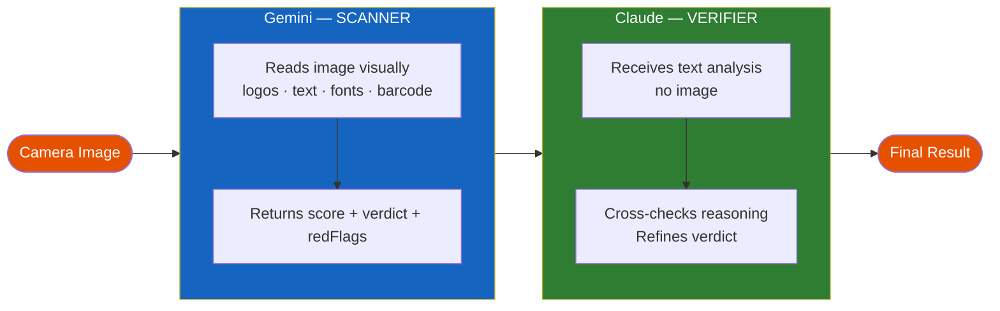
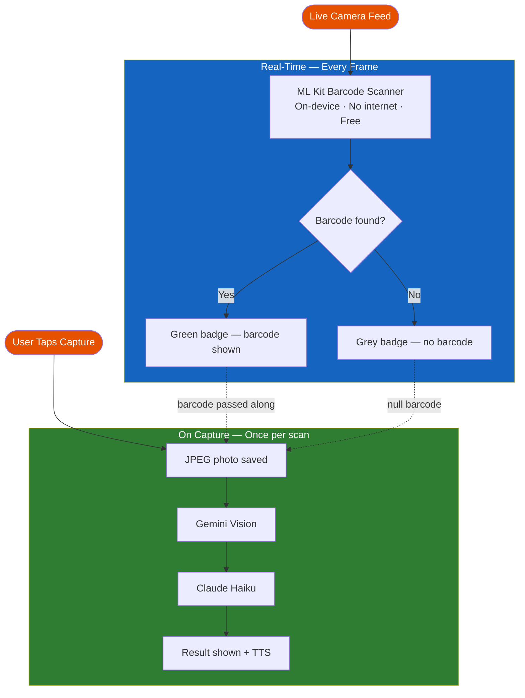

# FakeProductDetector

An AI-powered Android app that detects counterfeit products using **dual-AI verification** — Google Gemini Vision + Claude Haiku — delivering high-confidence authenticity assessments in seconds.

> Portfolio Project by **Lakshmana Reddy** | Android Tech Lead | [GitHub](https://github.com/lakshmanreddymv-bot)


---

## Screenshots

| Scan Result (Barcode) | Scan Result (No Barcode) |
|:---:|:---:|
|  |  |
| Tylenol · Barcode detected · **95/100 ✅** | Children's Acetaminophen · Image-only · **95/100 ✅** |

---

## Features

- **CameraX live preview** — real-time camera feed with ML Kit barcode overlay
- **ML Kit barcode scanning** — on-device, instant, free, works offline
- **Gemini 2.5 Flash Vision** — analyzes product packaging visually (text, logos, fonts, print quality)
- **Claude Haiku 4.5 verification** — cross-validates Gemini's reasoning for a refined verdict
- **Authenticity score 0–100** — clear verdict: `AUTHENTIC`, `SUSPICIOUS`, or `LIKELY_FAKE`
- **Red flag detection** — specific concerns flagged (mismatched labels, blurry print, wrong fonts, etc.)
- **TTS voice output** — result is read aloud after every scan
- **Room scan history** — all scans persisted locally with timestamps
- **Swipe-to-delete** — remove individual history entries with a swipe gesture
- **Smart scan validation** — warns before scanning plain objects without packaging or barcode to prevent misleading results
- **Offline detection** — friendly message shown when no internet is available
- **Rate limit handling** — countdown banners for Gemini 429 / daily quota errors
- **Clean Architecture + MVVM + Hilt + UDF**

---

## How It Works — AI Pipeline



1. **ML Kit** reads any barcode in the live camera frame in real-time before you tap Capture.
2. **Scan Validation** checks before proceeding — if no barcode is detected and category is OTHER, a warning dialog is shown to prevent meaningless scans.
3. **Gemini 2.5 Flash** receives the captured JPEG and analyzes packaging visually — logos, text, fonts, print quality, barcode data.
4. **Claude Haiku** receives Gemini's text analysis (no image) and cross-checks the reasoning for a refined final verdict.
5. **TTS** reads the result aloud. If Claude fails, Gemini's result is used directly — the app never crashes.

---

## Architecture

### Clean Architecture



### Unidirectional Data Flow (UDF)


### Scan Sequence



### Project Structure

```
FakeProductDetector/
├── domain/                          ← Pure Kotlin, zero Android dependencies
│   ├── model/                       # Product, ScanResult, Verdict, Category
│   ├── repository/
│   │   └── ProductRepository.kt     # Interface
│   └── usecase/
│       ├── ScanProductUseCase.kt
│       └── GetScanHistoryUseCase.kt
│
├── data/
│   ├── api/
│   │   ├── GeminiVisionApiImpl.kt   # Image → base64 → Gemini
│   │   ├── ClaudeVerificationApiImpl.kt
│   │   └── GeminiQuotaError.kt      # Sealed: TokenRPM | RequestRPM | Daily
│   ├── local/                       # Room: ScanEntity, ScanDao, ScanDatabase
│   └── repository/
│       └── ProductRepositoryImpl.kt # Offline guard → Gemini → Claude → Room
│
├── di/
│   └── AppModule.kt                 # Hilt: 2× Retrofit, OkHttp, Room
│
└── ui/
    ├── scan/    # ScanScreen, ScanViewModel, ScanUiState
    ├── result/  # ResultScreen, ResultViewModel
    ├── history/ # HistoryScreen, HistoryViewModel
    └── tts/     # TTSManager
```

---

## Role of Each AI / Tool

### ML Kit vs Gemini vs Claude

| | ML Kit | Gemini 2.5 Flash | Claude Haiku |
|---|---|---|---|
| **Role** | Barcode Reader | Vision Scanner | Verifier |
| **When runs** | Every live frame | Once on capture | After Gemini |
| **Input** | Live camera frame | JPEG photo | Gemini's text output |
| **Output** | Barcode string | Score + verdict + flags | Refined verdict |
| **Needs internet** | No — on-device | Yes | Yes |
| **Costs money** | Free | ~$0.0001/scan | ~$0.0001/scan |
| **Checks authenticity** | No | Yes — detailed | Yes — reasoned |

### Gemini vs Claude

| | Gemini 2.5 Flash | Claude Haiku |
|---|---|---|
| **Role** | The Scanner | The Verifier |
| **Can see images?** | Yes | No |
| **Analogy** | Lab technician running tests | Senior doctor reviewing results |

### How They Work Together



### Where ML Kit Runs



---

## Tech Stack

| Layer | Technology |
|-------|-----------|
| Language | Kotlin 2.2.10 |
| UI | Jetpack Compose + Material 3 |
| Architecture | Clean Architecture + MVVM + UDF |
| DI | Hilt 2.59.1 |
| Camera | CameraX 1.3.4 |
| Barcode | ML Kit Barcode Scanning 17.3.0 |
| AI — Vision | Google Gemini 2.5 Flash (v1beta) |
| AI — Verification | Anthropic Claude Haiku 4.5 |
| TTS | Android TextToSpeech |
| Networking | Retrofit 2.11.0 + OkHttp 4.12.0 |
| Database | Room 2.7.1 |
| Image Loading | Coil 2.6.0 |
| Navigation | Navigation Compose 2.7.7 |
| Build | AGP 9.1.0, Kotlin 2.2.10 |

---

## Setup

### Prerequisites

- Android Studio Hedgehog or newer
- Android device / emulator with camera (API 26+)
- Google Gemini API key (billing enabled)
- Anthropic API key

### 1. Clone

```bash
git clone https://github.com/lakshmanreddymv-bot/FakeProductDetector.git
cd FakeProductDetector
```

### 2. Add API keys

Create `local.properties` in the project root — **do not commit this file**:

```properties
sdk.dir=/path/to/your/Android/sdk
gemini.api.key=YOUR_GEMINI_API_KEY_HERE
anthropic.api.key=YOUR_ANTHROPIC_API_KEY_HERE
```

### 3. Enable Gemini billing

- Visit [Google AI Studio](https://aistudio.google.com/) → Get API Key
- Enable billing at [Google Cloud Console](https://console.cloud.google.com/billing)
- The app uses `gemini-2.5-flash` which requires a billing-enabled project

**Cost per scan:** Gemini + Claude together cost roughly **$0.0002** per scan (~$0.0001 each).

### 4. Build & run

```bash
./gradlew assembleDebug
```

Or open in Android Studio → Run ▶

---

## Unit Tests

### Structure

```
app/src/test/
└── com/example/fakeproductdetector/
    ├── data/api/
    │   ├── GeminiQuotaErrorTest.kt       ← Sealed class coverage
    │   └── GeminiVisionApiImplTest.kt    ← JSON parsing, verdict/score parsing
    ├── domain/
    │   ├── model/ScanResultTest.kt       ← Model classes, enums
    │   └── usecase/ScanProductUseCaseTest.kt  ← ScanEvent flow, Mockito
    └── ui/scan/ScanUiStateTest.kt        ← All sealed UI states
```

### Run

```bash
./gradlew test                      # All unit tests
./gradlew testDebugUnitTest         # Debug variant only
./gradlew testDebugUnitTest --info  # Verbose output
```

### Coverage

| Area | Tests | Status |
|------|-------|--------|
| Domain models (Product, ScanResult, Verdict, Category) | 10 | 100% |
| Sealed UI states (Idle / Loading / Error / RateLimited / Success) | 10 | 100% |
| GeminiQuotaError sealed class | 6 | 100% |
| JSON extraction + verdict/score parsing | 13 | 100% |
| ScanProductUseCase — mocked repository, ScanEvent flow | 7 | 100% |

---

## Issues & Fixes

Real bugs encountered during development — useful for anyone building Android AI apps.

### 1. Black Screen on Camera Launch

**Problem:** Camera preview showed a black screen after granting permission.
**Cause:** App jumped straight into camera without verifying runtime CAMERA permission was granted.
**Fix:** Added `rememberLauncherForActivityResult(RequestPermission)` + `hasCameraPermission` state gate in `ScanScreen`.

```kotlin
var hasCameraPermission by remember {
    mutableStateOf(context.checkSelfPermission(CAMERA) == PERMISSION_GRANTED)
}
```

---

### 2. HTTP 404 — Wrong Gemini Endpoint

**Attempts:**
- `v1beta/models/gemini-2.0-flash` → 404
- `v1/models/gemini-2.0-flash` → 404

**Cause:** `gemini-2.0-flash` is no longer available to new users.
**Fix:** Switched to `v1beta/models/gemini-2.5-flash`.

```kotlin
@POST("v1beta/models/gemini-2.5-flash:generateContent")
suspend fun generateContent(@Body request: GeminiRequest): GeminiResponse
```

---

### 3. HTTP 429 — Retry Loop Compounding Rate Limits

**Problem:** On the free tier (15 RPM), failed scans triggered 3 retries → 3× 429 errors, extending the cooldown.
**Fix:** Removed all retry logic on 429. Throw immediately, show countdown banner. Added `isScanning` guard.

---

### 4. Duplicate Functions — Build Error

**Problem:** `str_replace` left duplicate `parseResponse` and `extractJson` functions in `GeminiVisionApiImpl`.
**Fix:** Full file overwrite to eliminate duplicates cleanly.

---

### 5. Wrong Claude Model ID

**Problem:** `claude-haiku-4-5` → 404 from Claude API.
**Fix:** Correct model ID is `claude-haiku-4-5-20251001`.

---

### 6. Image Too Large — OkHttp Timeout

**Problem:** Full-resolution camera images (5 MB+) caused 60s timeouts on Gemini API.
**Fix:** Added `compressImage()` — scales to max 1024 px, JPEG 85%, reducing 5 MB → ~150 KB.

---

### 7. OkHttp Default Timeouts Too Short

**Problem:** Gemini Vision analysis takes 5–10s; OkHttp's 10s default caused sporadic failures.
**Fix:**

```kotlin
OkHttpClient.Builder()
    .connectTimeout(30, TimeUnit.SECONDS)
    .readTimeout(60, TimeUnit.SECONDS)
    .writeTimeout(60, TimeUnit.SECONDS)
```

---

### 8. Billing Required but v1 Endpoint Still 404

**Problem:** After enabling Google Cloud billing, `v1/models/gemini-2.0-flash` still returned 404.
**Cause:** `gemini-2.0-flash` on `v1` is restricted to pre-March 2026 customers.
**Fix:** Use `v1beta/models/gemini-2.5-flash` — available to all new billing users.

---

## Real-World Use Cases

### With Barcode — Highest Confidence

Point the camera at a product barcode. ML Kit detects it in real-time (green badge appears before tapping Capture).

```
Product:  Tylenol Children's Oral Suspension
Barcode:  300450122377 (auto-detected)
Score:    95 / 100  AUTHENTIC

Gemini:   UPC barcode resolves to Children's Tylenol Oral Suspension, Berry Flavor.
          Print quality is clear and professional with no spelling errors.
Claude:   Cross-verified and confirmed authentic.
```

---

### Without Barcode — Image Only

Point at the side panel or back label. Gemini reads packaging text and analyzes it visually.

```
Product:  Children's Liquid Acetaminophen
Barcode:  No barcode detected — image-only scan
Score:    95 / 100  AUTHENTIC

Gemini analyzed:
  Warnings section layout matches genuine Tylenol formatting
  Acetaminophen dosage instructions are medically accurate
  Overdose warning text matches official McNeil labeling
  Font and spacing are professional quality
```

---

### Offline — No Internet

```
No internet connection detected.
Connect to the internet for full AI analysis.
```

The app saves the record locally and shows a friendly message — no crash, no spinner.

---

### Scan Mode Comparison

| | With Barcode | Without Barcode |
|---|---|---|
| **Badge** | Green | Grey |
| **Product ID** | Barcode + image | Image only |
| **Works for** | Packaged goods | Any label / packaging |

---

### Smart Scan Warning

When you point the camera at a plain object with no barcode detected and category set to OTHER, the app warns you before scanning:

> "For best results, point the camera at a product with visible packaging, labels, brand logos, or a barcode."

This prevents misleading results — for example, a sofa pillow scoring 95/100 Authentic.

| Scenario | Behaviour |
|---|---|
| Plain fabric, no barcode, category = OTHER | Warning dialog shown |
| Medicine box with barcode | Scan proceeds immediately |
| Electronics, no barcode, category = ELECTRONICS | Scan proceeds immediately |
| Any product with category set | Scan proceeds immediately |

Tap **"Scan Anyway"** to override and proceed. Tap **"Cancel"** to stay on the scan screen and reframe the shot.

---

## Roadmap

- [ ] On-device ML model (TFLite) — pre-scan filter to skip cloud APIs for high-confidence cases
- [ ] Category auto-detection from image — remove need to select manually
- [ ] Product database for known counterfeits
- [ ] Share scan result as image / PDF
- [ ] Batch scanning mode
- [ ] Multi-language support
- [ ] Additional product categories

---

## Portfolio

This is **Project 2** in a series of AI-powered Android apps:

| # | Project | Status | Description |
|---|---------|--------|-------------|
| 1 | [MySampleApplication-AI](https://github.com/lakshmanreddymv-bot/MySampleApplication-AI) | Complete | AI assistant foundation |
| 2 | **FakeProductDetector** | Complete | Dual-AI product authentication |
| 3 | Coming Soon | Building | — |

---

## License

```
MIT License — Copyright (c) 2026 Lakshmana Reddy
```

---

## Author

**Lakshmana Reddy**
Android Tech Lead · 12 years experience · Pleasanton, CA
[GitHub](https://github.com/lakshmanreddymv-bot)